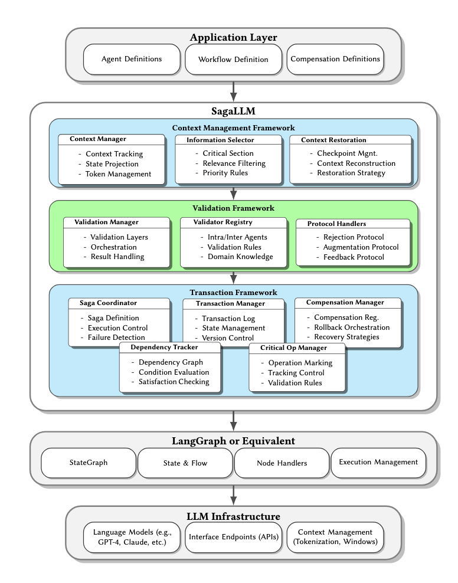
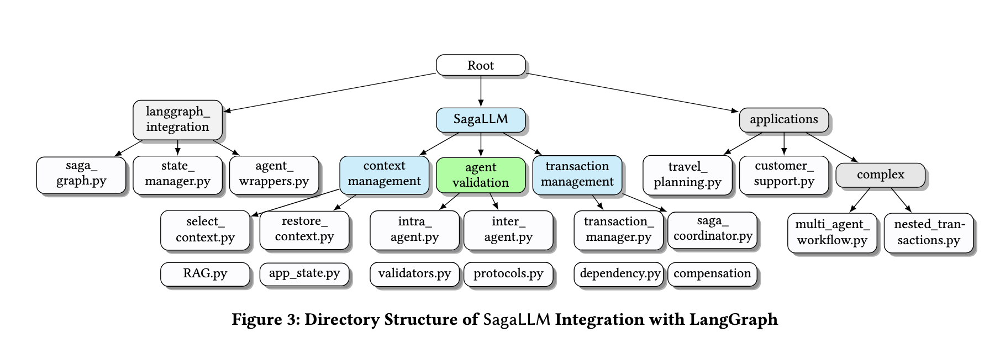

# **SagaLLM: Context Management, Validation, and Transaction Guarantees for Multi-Agent LLM Planning**

```
What if LLM and Agent lost track of information? Reverting back as a transaction!

--- SagaLLM Authors
```
<p align="center">
  ⬇️ <a href="https://github.com/genglongling/REALM-Bench?tab=readme-ov-file">Github</a>  
  📃 <a href="https://arxiv.org/abs/2502.18836">Paper</a>  
  🌐 <a href="https://example.com/project">Project Page</a>  
  🎬 <a href="https://youtu.be/FtVVQzks0xk">Demo Video</a>
</p>

## Demo Video
[](https://www.youtube.com/watch?v=FtVVQzks0xk "SagaLLM: Context Management, Validation, and Transaction Guarantees for Multi-Agent LLM Planning")

This repository extends based on the REALM-Bench (a general mutli-agent framework for of real-world use cases of Multi Agentic Design, Orchestration, and Planning in Real-World Scenerios).
The SagaLLM provides a **comprehensive middleware** for agent application layer and multi-agent databases.

  
1. It supports **Application Layer** for:
    - **Planning and Scheduling:** 1) Sequential planning, 2) Reactive planning, 3) Complex planning, 4) Others
   - **Tool Use:** 1) WriteToFile, 2) GoogleSearchAPI, 3) Other API (e.g. Financial), 4) Others
   - **Reflection**
   - **Memory**
   - **Reasoning**
   - **Forecasting**
   - **Math Induction, Calculation**
   - **Multi-Agent Collaboration**: workflow generation

2. It supports **Multi-Agent Database Frameworks** across different agent ecosystems:  
   - **AutoGen**  
   - **CrewAI**  
   - **Swarm**  
   - **LangGraph**  

## **🌟 New Feature: SagaLLM Interactive Web Application**

We've implemented a Streamlit-based web application that allows you to interact with SagaLLM's multi-agent systems through a graphical interface. This application enables:

1. **Multi-Agent Template Generation**: Transform your scenarios into intelligent agent workflows
2. **Agent Execution Visualization**: Watch as multiple specialized agents collaborate on your tasks
3. **Real-time Execution Monitoring**: Track the progress and output of each agent
4. **Detailed Planning Analysis**: Get comprehensive results including timelines and recommendations

The web application includes full functionality for complex scenarios like wedding logistics planning, project coordination, travel arrangements, and more.

### **Running the Web Application**
To launch the interactive web application:
```bash
cd applications
streamlit run streamlit_frontend.py
```

The interface provides:
- Scenario input area for your specific requirements
- Pre-configured example scenarios to explore system capabilities
- Graphical visualization of agent dependencies and workflows
- Detailed execution results with comprehensive scheduling information

## **Key Functions of `Saga` libraries**

- 1) Context Management Framework
- 2) Validation Framework
- 3) Transaction Framework
- 4) Extension of multi-agent frameworks,
- 5) Built for application layers.
     

| **Function**            | **Description**                                      | **Function Name**                      | **Input**                                      |
|-------------------------|------------------------------------------------------|-----------------------------------------|------------------------------------------------|
| **Transaction Manager** | Defines context, agents, and dependencies.          | `transaction_manager(self, agents, dependencies, context)` | List of agents, dependencies, and context.   |
| **Saga Coordinator**    | Executes agents with optional rollback support.     | `saga_coordinator(self, with_rollback, agents)` | `with_rollback` (boolean flag), agent list.  |
| **Intra-Agent Details** | Prints each agent's execution details.              | `intra_agent(self, agents)`            | Agent list.                                   |
| **Inter-Agent Dependencies** | Displays inter-agent dependencies.          | `inter_agent(self, dependency_graph)`  | Agent dependency graph.                      |
| **Select Context**      | Allows user to query execution context of a node.   | `select_context(self, node_name)`       | User-input node name.                         |
| **Restore Context**     | Rolls back execution of a specified agent.          | `restore_context(self, agent_name)`     | User-input agent to rollback.                |


---

## **🔹 Key Features of Using `SagaCoordinator` Instead of Previous `Crew`**

| Feature             | Crew                                        | SagaCoordinator                     |
|---------------------|-------------------------------------------|------------------------------------|
| **Task Execution**  | Runs agents in topological order          | Runs agents sequentially with rollback |
| **Error Handling**  | No built-in error handling                | Rolls back on failure               |
| **Transaction Safety** | No rollback mechanism                  | Full rollback support               |
| **Use Case**        | Dependency management                     | Resilient transaction flow          |

---

## **🚀 How To Run**  

### **1️⃣ Setup Environment**  
Follow these steps to get started:  

- **Create a virtual environment**  
  ```bash
  python3 -m venv venv
  ```
  making sure your program using python==3.10+ for your venv on your editor.
  
- **Activate the virtual environment**  
  - macOS/Linux:  
    ```bash
    source venv/bin/activate
    ```  
  - Windows:  
    ```bash
    venv\Scripts\activate
    ```  
- **Install dependencies**  
  ```bash
  pip install -r requirements.txt
  ```  
- **Set up OpenAI API credentials**  
  - Create a `.env` file in the root directory  
  - Add your OpenAI API key:  
    ```env
    OPENAI_API_KEY="sk-proj-..."
    ```  

---

### **2️⃣ Running Multi-Agent Frameworks**
You can execute agents using one of the frameworks:  

- **Run an agent framework**  
  ```bash
  python agent_frameworks/openai_swarm_agent.py
  ```  
- **Using AutoGen**  
  - Ensure **Docker** is installed ([Get Docker](https://docs.docker.com/get-started/get-docker/))  
  - Start Docker before running AutoGen-based agents  

---
### **3️⃣ Using the SagaLLM Library**
You can execute transactions using saga:  

  ```bash
  cd applications
  python3 multiagent-p5.py
  python3 multiagent-p6.py
  python3 multiagent-p8.py
  python3 multiagent-p9.py
  ```

For the interactive web application:
  ```bash
  cd applications
  streamlit run template_demo.py
  ```

--- 
## **Example Use Case: Wedding Logistics Planning**

This example shows how to use SagaLLM to coordinate a complex wedding day logistics plan involving multiple agents:

```python
import sys
import os
from multi_agent.saga import Saga
from multi_agent.agent import Agent

# Initialize Saga
saga = Saga()

# Define specialized agents for the wedding logistics planning
LT_Agent = Agent(
    name="Locations and Time Setup Agent",
    backstory="You define locations, travel times, and guest arrival schedules.",
    task_description="Set up locations, travel times, and ensure accurate scheduling of arrivals.",
    task_expected_output="Structured location data and expected arrival times."
)

TS_Agent = Agent(
    name="Task Setup Agent",
    backstory="You manage the scheduling of required wedding tasks.",
    task_description="Schedule gift collection after 12:00 PM, clothes pickup before 2:00 PM, and ensure photo session at 3:00 PM.",
    task_expected_output="Optimized task schedule aligned with constraints."
)

RM_Agent = Agent(
    name="Resource Management Agent",
    backstory="You allocate available transport resources efficiently.",
    task_description="Coordinate vehicle usage for guest transportation and task fulfillment.",
    task_expected_output="Optimized vehicle allocation ensuring timely arrivals."
)

CV_Agent = Agent(
    name="Constraint Validation Agent",
    backstory="You verify all scheduling constraints to ensure smooth execution.",
    task_description="Ensure all tasks are completed within operating hours and vehicle constraints are met.",
    task_expected_output="Validated schedule with no conflicts."
)

WEO_Agent = Agent(
    name="Wedding Event Oversight Agent",
    backstory="You oversee the entire wedding logistics to ensure a smooth execution of tasks.",
    task_description="Monitor and ensure all tasks are completed on time, resolving any logistical issues.",
    task_expected_output="Complete wedding scheduling plan for people, tasks and time."
)

# Register Agents in Saga
saga.transaction_manager([LT_Agent, TS_Agent, RM_Agent, CV_Agent, WEO_Agent])

# Execute with rollback enabled
saga.saga_coordinator(with_rollback=True)

# Print agent details and context
saga.intra_agent()
saga.inter_agent()
```

The system produces a comprehensive wedding day schedule with precise timing:

## Wedding Day Schedule

| Time              | Activity                                     | People Involved          | Assigned Vehicle/Role  |
|-------------------|----------------------------------------------|--------------------------|------------------------|
| 11:00 AM – 12:00 PM | Pick up Alex at Boston Airport               | Pat, Alex                | Car 1 (Pat)            |
| 12:00 PM – 1:00 PM  | Wait for Jamie at airport, then depart       | Pat, Alex, Jamie         | Car 1 (Pat)            |
| 1:00 PM – 1:30 PM   | Drive to Tailor Shop to pick up clothes      | Pat, Alex, Jamie         | Car 1 (Pat)            |
| 1:30 PM – 2:15 PM   | Drive to Gift Shop and collect gifts         | Pat, Alex, Jamie         | Car 1 (Pat)            |
| 2:15 PM – 2:45 PM   | Drive to Wedding Venue                       | Pat, Alex, Jamie         | Car 1 (Pat)            |
| 3:00 PM             | Attend wedding photo session                 | Everyone                 | All available at venue |

---
## ✅ Final Thoughts

- If everything **succeeds**, all agents complete. ✅ 
- If any **agent fails**, all completed agents **roll back automatically, or by inputing a specific node**.  ✅ 
- Ensures **multi-agent consistency** in real-world applications (e.g., **stock trading, planning, scheduling, transaction, or payments**).  ✅ 

---

## **📂 Project Structure**  


---

## **📜 Citation**  

If you find this repository helpful, please cite the following paper:  

```
SagaLLM: Context Management, Validation, and Transaction Guarantees for Multi-Agent LLM Planning  
Anonymous Author(s)  
```

---

